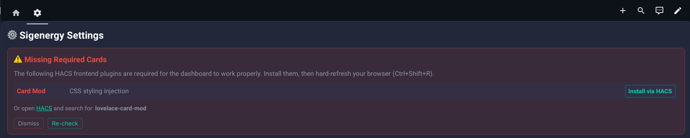

# Genergy  Dashboard — Sigenergy Inspired Dashboard

[](https://github.com/hacs/integration)
[](LICENSE)

[](https://my.home-assistant.io/redirect/hacs_repository/?owner=SpengeSec&repository=Genergy-Dashboard](https://my.home-assistant.io/redirect/hacs_repository/?owner=SpengeSec&repository=Genergy-Dashboard&category=integration))

> **⚠️ Active Development**
>
> This project is under active development. The **Overview** and **Settings** views are fully functional.
> Other views (History, Devices, etc.) may be incomplete or under construction.
>
> Feedback and bug reports are welcome!

A fully configurable Home Assistant Lovelace dashboard for monitoring solar, battery, and grid energy systems. Features animated power flow visualization, real-time energy charts with EMHASS forecast overlays, battery pack monitoring, and a 4-tab settings UI for complete customization — no YAML editing required.

> **Inverter-agnostic**: Works with **any** solar/battery inverter (Deye, SunSynk, Sigenergy, Huawei, Fronius, SolarEdge, Enphase, etc.) — just map your entity IDs in the Settings tab.

---

## Screenshots

### Dashboard Overview
Animated house card with real-time power flow, sankey energy diagram, and battery system status — all in one view.


### Energy Charts & EMHASS Forecasts
48-hour time-series chart with solar, battery, grid, and consumption traces — plus EMHASS MPC forecast overlays, price curves, and deferrable load schedules.


### Settings Card
4-tab configuration UI with live entity validation — no YAML editing required. Map your entities, toggle features, configure pricing, and set display preferences.


### Responsive House Design
Toggle EV Charger and Heat Pump in the settings to dynamically update the house card — the garage gate opens to show the EV charging, and the heat pump unit appears on the side of the house.


### Cable Path Editor
Built-in visual cable path editor for customizing the animated power flow routes on the house card. Drag control points to reposition cables, snap to grid, and apply changes instantly.


---

## Table of Contents

- [Screenshots](#screenshots)
- [Features](#features)
- [Prerequisites](#prerequisites)
- [Installation](#installation)
- [Automated Prerequisite Detection](#automated-prerequisite-detection)
- [Quick Start Guide](#quick-start-guide)
- [Configuration Guide](#configuration-guide)
- [Entity Reference](#entity-reference)
- [Feature Toggles](#feature-toggles)
- [Pricing Configuration](#pricing-configuration)
- [Display Preferences](#display-preferences)
- [House Card Customization](#house-card-customization)
- [Responsive Layout](#responsive-layout)
- [Dependencies](#dependencies)
- [Troubleshooting](#troubleshooting)
- [Project Structure](#project-structure)
- [Contributing](#contributing)
- [License](#license)

---

## Features

### Overview Dashboard
- **Animated House Card** — Isometric 3D house with real-time animated power flow "comets" showing solar generation, battery charge/discharge, grid import/export, EV charging, and heat pump usage
- **Responsive House Design** — Toggle EV charger/heat pump in settings and the house card updates dynamically: garage gate opens to show EV charging, heat pump unit appears on the house exterior
- **Cable Path Editor** — Built-in visual editor for customizing animated power flow cable routes with drag-to-reposition control points and snap-to-grid
- **Sankey Energy Flow** — Visual energy flow diagram showing power distribution from sources (Solar, Grid, Battery) to sinks (Home, Battery, Grid, EV, Heat Pump). Entities below 0.1 kWh are automatically hidden for a cleaner chart. Rounded to 1 decimal place
- **Battery System Card** — SVG-based battery stack visualization with expandable detail panels for each inverter and battery pack (SoC, SoH, voltage, current, cycles, cell voltages, temperatures)
- **Status Cards** — Real-time power values (Solar, Home, Battery, Grid) and daily energy totals (kWh)

### Energy Charts
- **ApexCharts Integration** — 24h or 48h time-series chart with Solar, Battery, Grid, and Consumption traces
- **EMHASS Forecast Overlay** — Dashed forecast lines for planned PV, battery, grid, load, SOC, and price targets
- **Price Overlay** — Import/export electricity price curves on secondary Y-axis
- **Deferrable Load Tracking** — Heat pump, boiler, and other deferrable load schedules

### Settings UI (No YAML Required)
- **4-tab configuration card** with live entity validation
- **Entity Configuration** — Map your HA entities to ~70 dashboard slots with real-time state badges
- **Auto-Detect from HA Energy Dashboard** — One-click detection of grid sources, solar, battery, Solcast, EV chargers, and heat pumps from your HA Energy Dashboard configuration. Supports broadened keyword matching for 30+ EV charger brands (Tesla, Zappi, Easee, Wallbox, ChargePoint, etc.) and 20+ heat pump brands (Daikin, Nibe, Vaillant, Viessmann, etc.)
- **Cumulative Sensor Support** — Automatically detects cumulative (lifetime total) energy sensors and creates HA utility_meter helpers for daily tracking. Works with both daily-resetting and always-increasing sensor types
- **EV & Heat Pump in Sankey** — Add EV and/or heat pump energy as destination nodes in the Sankey flow chart, with auto-detect and daily meter auto-creation for cumulative sensors
- **Feature Toggles** — Enable/disable EV charger, heat pump, EMHASS, solar forecast, financial tracking
- **Pricing Setup** — Configure price entities, thresholds, currency
- **Display Preferences** — Decimal places, chart range, SoC ring thresholds, power auto-scaling
- **Responsive Toggle UI** — Optimized event handling prevents missed clicks and lag; hass state updates no longer trigger full DOM rebuilds

### Theme & Responsiveness
- **Bundled dark theme** (`sigenergy_dark`) — consistent appearance regardless of your HA theme
- **Responsive layout** — Adapts from 3-column desktop to 2-column tablet to single-column mobile

---

## Prerequisites

### Required

- **Home Assistant** 2024.1.0 or newer
- **HACS** (Home Assistant Community Store) — [Installation Guide](https://hacs.xyz/docs/setup/download)

### Required HACS Frontend Plugins

The dashboard requires the following HACS frontend plugins. **The integration automatically detects missing cards** and shows a banner in the Settings view with direct install links for each one:



You can also install them manually:

| Plugin | Install Link | Purpose |
|---|---|---|
| [Layout Card](https://github.com/thomasloven/lovelace-layout-card) | [](https://my.home-assistant.io/redirect/hacs_repository/?owner=thomasloven&repository=lovelace-layout-card) | Responsive grid layout |
| [ApexCharts Card](https://github.com/RomRider/apexcharts-card) | [](https://my.home-assistant.io/redirect/hacs_repository/?owner=RomRider&repository=apexcharts-card) | Energy time-series charts |
| [Sankey Chart Card](https://github.com/MindFreeze/ha-sankey-chart) | [](https://my.home-assistant.io/redirect/hacs_repository/?owner=MindFreeze&repository=ha-sankey-chart) | Energy flow diagram |
| [Mushroom Cards](https://github.com/piitaya/lovelace-mushroom) | [](https://my.home-assistant.io/redirect/hacs_repository/?owner=piitaya&repository=lovelace-mushroom) | Status pills and cards |
| [Card Mod](https://github.com/thomasloven/lovelace-card-mod) | [](https://my.home-assistant.io/redirect/hacs_repository/?owner=thomasloven&repository=lovelace-card-mod) | CSS styling injection |

> **Note**: After installing the plugins, restart Home Assistant and hard-refresh your browser (Ctrl+Shift+R / Cmd+Shift+R).

### Optional Integrations

| Integration | Purpose |
|---|---|
| [EMHASS](https://github.com/davidusb-geern/emhass) | Energy optimization, MPC forecasts, financial tracking |
| [Nordpool](https://github.com/custom-components/nordpool) | Electricity spot prices (Europe) |
| [Solcast PV Forecast](https://github.com/oziee/ha-solcast-solar) | Solar production forecasts |
| Gobel Battery Monitor or similar BMS | Per-pack cell voltage and temperature monitoring |

---

## Installation

### Step 1: Install Dependencies

The integration will **automatically detect** missing HACS frontend plugins and guide you through installation (see [Prerequisites](#prerequisites)). You can also pre-install them via the install links above.

Restart Home Assistant after installing any new plugins.

### Step 2: Install Genergy Dashboard

#### Via HACS (Recommended)

[](https://my.home-assistant.io/redirect/hacs_repository/?owner=SpengeSec&repository=Genergy-Dashboard)

1. Click the button above, or open **HACS** → **Integrations** → click the three dots (⋮) → **Custom repositories**
2. Paste the GitHub repository URL, select **Integration** as category, click **Add**
3. Search for **Genergy Dashboard** and click **Install**
4. Restart Home Assistant

#### Manual Installation

1. Download the latest release ZIP
2. Copy the `custom_components/genergy_dashboard/` folder to your HA config directory:
   ```
   custom_components/genergy_dashboard/ → /config/custom_components/genergy_dashboard/
   ```
3. Restart Home Assistant

### Step 3: Add the Integration

1. In Home Assistant go to **Settings → Devices & Services → Add Integration**
2. Search for **Genergy Dashboard**
3. A guided config flow walks you through entity mapping:
   - **Step 1 — Core Sensors**: Map your solar, battery, grid, and load power entities
   - **Step 2 — Energy Totals**: Map daily energy sensors (solar, consumption, grid import/export, battery charge/discharge)
   - **Step 3 — Features**: Enable optional features (EMHASS, Solcast, EV charger, heat pump) and map their entities
4. Click **Submit** — the integration automatically:
   - Registers the dashboard in Lovelace with **Show in Sidebar** enabled
   - Generates the full dashboard configuration from the template + your entity mappings
   - Installs the bundled `sigenergy_dark` theme
   - Registers the JS resources for custom cards (house card, settings card, device card)
5. The **Sigenergy** dashboard appears in the sidebar immediately — no restart required

> **Sigenergy users**: Check the "Use Sigenergy defaults" checkbox on the first step. This pre-fills all entity IDs with the correct Sigenergy naming convention (`sensor.sigen_plant_*` / `sensor.sigen_inverter_*`) and creates the dashboard immediately — no manual entity mapping required.

> **Note**: The dashboard is created with URL path `dashboard-sigenergy`. The settings card uses this path to persist your configuration.

---

## Automated Prerequisite Detection

The integration includes a **two-layer detection system** that automatically checks for required HACS frontend plugins:

### Backend Detection (on startup)
When the integration loads, it scans your Lovelace resource list for the 5 required cards. If any are missing:
- A **persistent notification** appears in Home Assistant with direct install links for each missing card
- A **Repair issue** is created in **Settings → System → Repairs** with a warning

### Frontend Detection (in the Settings view)
When you open the Settings tab, the dashboard checks if required custom elements are registered in the browser. If any are missing:
- A **red banner** appears at the top of the Settings card listing each missing card with:
  - Card name and purpose
  - **"Install via HACS" button** that links directly to the correct HACS repository page (via [my.home-assistant.io](https://my.home-assistant.io))
  - Fallback search terms for manual HACS browsing
- **Dismiss** button to hide the banner (stored in localStorage)
- **Re-check** button to verify after installing


> **After installing missing cards**: Restart Home Assistant, then hard-refresh your browser (Ctrl+Shift+R / Cmd+Shift+R). The banner will automatically disappear once all cards are detected.

---

## Quick Start Guide

After adding the integration, the dashboard is pre-configured with your entity mappings:

1. Navigate to the **Sigenergy** dashboard in the sidebar
2. Verify your data is showing correctly in the overview
3. Open the **Settings** tab (⚙️ gear icon) to fine-tune:
   - **⚡ Entities** — Adjust or add entity mappings (each field shows a live state badge)
   - **🔧 Features** — Toggle EV charger, heat pump, EMHASS, solar forecast, etc.
   - **💰 Pricing** — Configure price entities, thresholds, currency
   - **🎨 Display** — Decimal places, chart range, SoC thresholds, power auto-scaling
4. Click **💾 Save & Apply** at the bottom of the Display tab
5. The dashboard rebuilds automatically with your updated configuration

> **Tip**: If you skipped any optional entities during the config flow, you can add them later in the Settings tab.

---

## Configuration Guide

### Finding Your Entity IDs

Go to **Developer Tools** → **States** in Home Assistant and search for your inverter's entities. Common patterns by brand:

| Inverter | Solar Power | Battery Power | Grid Power |
|---|---|---|---|
| **Deye** | `sensor.deyeinverter_pv_power` | `sensor.deyeinverter_battery_output_power` | `sensor.deyeinverter_grid_load_l1` |
| **SunSynk** | `sensor.sunsynk_pv_power` | `sensor.sunsynk_battery_power` | `sensor.sunsynk_grid_power` |
| **Sigenergy** | `sensor.sigen_plant_pv_power` | `sensor.sigen_plant_battery_power` | `sensor.sigen_plant_grid_active_power` |
| **Huawei** | `sensor.inverter_input_power` | `sensor.battery_charge_discharge_power` | `sensor.power_meter_active_power` |
| **SolarEdge** | `sensor.solaredge_current_power` | `sensor.solaredge_storage_power` | `sensor.solaredge_grid_power` |
| **Fronius** | `sensor.fronius_pv_power` | `sensor.fronius_battery_power` | `sensor.fronius_grid_power` |

> These are examples — actual entity names depend on your specific setup. Check Developer Tools → States.

### Config Persistence

Your settings are stored in two places for reliability:
1. **Browser localStorage** — instant load on page open (fast cache)
2. **HA dashboard config** — synced via WebSocket, survives browser cache clears

Settings auto-sync between browsers on the same HA instance.

### Sigenergy Auto-Detect

If you have a **Sigenergy** inverter system, the integration includes a comprehensive auto-detect feature that scans for `sensor.sigen_*` entities in your Home Assistant instance and automatically maps:

- **Plant-level**: solar power, load power, battery power, battery SoC, grid active power, and all daily energy totals
- **Inverter-level**: inverter temperature, battery temperature, and PV string power (PV1–PV6)
- **Battery sign convention**: Automatically sets `battery_positive_charging: true` (Sigenergy uses positive values for charging)
- **PV string count**: Detects how many PV strings are connected and sets the count accordingly

To use: check the "**Use Sigenergy defaults**" checkbox on the first step of the config flow. Or in the Settings tab, click **Auto-Detect** and the Sigenergy entities will be mapped automatically.

---

## Entity Reference

### Core Power Entities (Required)

| Settings Field | Description | Example |
|---|---|---|
| `solar_power` | Real-time solar generation (W) | `sensor.inverter_pv_power` |
| `load_power` | Real-time home consumption (W) | `sensor.inverter_load_power` |
| `battery_power` | Battery charge/discharge power (W) | `sensor.inverter_battery_power` |
| `battery_soc` | Battery state of charge (%) | `sensor.inverter_battery_soc` |
| `grid_power` | Grid import/export power (W) | `sensor.inverter_grid_power` |

### Daily Energy Totals (Recommended)

| Settings Field | Description |
|---|---|
| `solar_energy_today` | Total solar generation today (kWh) |
| `load_energy_today` | Total consumption today (kWh) |
| `battery_charge_today` | Energy charged into battery today (kWh) |
| `battery_discharge_today` | Energy discharged from battery today (kWh) |
| `grid_import_today` | Grid import today (kWh) |
| `grid_export_today` | Grid export today (kWh) |

### EV Charger Entities (Optional — Enable in Features)

| Settings Field | Description |
|---|---|
| `ev_charger_power` | EV charger power draw (W) |
| `ev_charger_status` | Charger status (charging/idle/etc.) |
| `ev_soc` | Electric vehicle battery state of charge (%) |
| `ev_charger_energy_today` | EV energy charged today (kWh) |
| `ev_energy_today` | Daily EV energy sensor for Sankey graph (kWh) — auto-detected from HA Energy Dashboard |
| `ev_energy_daily_meter` | Auto-created utility_meter entity for cumulative EV sensors (read-only) |

### Heat Pump Entity (Optional — Enable in Features)

| Settings Field | Description |
|---|---|
| `heat_pump_power` | Heat pump power consumption (W) |
| `heat_pump_energy_today` | Daily heat pump energy for Sankey graph (kWh) — auto-detected from HA Energy Dashboard |
| `hp_energy_daily_meter` | Auto-created utility_meter entity for cumulative HP sensors (read-only) |

### EMHASS MPC Entities (Optional — Enable EMHASS in Features)

| Settings Field | Description |
|---|---|
| `emhass_mode` | Current optimization mode (CHARGE/DISCHARGE/IDLE) |
| `emhass_reason` | Human-readable decision reason |
| `emhass_battery_action` | Battery action command summary |
| `mpc_battery` | MPC battery power forecast (attribute: `battery_scheduled_power`) |
| `mpc_grid` | MPC grid power forecast (attribute: `forecasts`) |
| `mpc_pv` | MPC PV generation forecast (attribute: `forecasts`) |
| `mpc_soc` | MPC battery SoC forecast (attribute: `battery_scheduled_soc`) |
| `mpc_load` | MPC load forecast (attribute: `forecasts`) |

### EMHASS Financial Entities (Optional — Enable Financial Tracking)

| Settings Field | Description |
|---|---|
| `buy_price` | EMHASS buy price forecast (attribute: `unit_load_cost_forecasts`) |
| `sell_price` | EMHASS sell price forecast (attribute: `unit_prod_price_forecasts`) |
| `cost_today` | Today's electricity cost |
| `savings_today` | Today's estimated savings |

### Price Entities (Optional)

| Settings Field | Description |
|---|---|
| `nordpool` | Nordpool spot price sensor |
| `current_import_price` | Live import electricity price (€/kWh) |
| `current_export_price` | Live export electricity price (€/kWh) |

### Battery Pack Monitoring (Optional)

| Settings Field | Description |
|---|---|
| `battery_pack1_soc` – `battery_pack8_soc` | Individual pack SoC sensors (up to 8 packs) |
| `battery_pack_prefix` | BMS entity prefix (e.g., `sensor.battery_monitor_pack_`) for expandable detail panels showing cell voltages, temperatures, SoH, and cycle count |

### Inverter & System Detail Entities (Optional)

| Settings Field | Description |
|---|---|
| `inverter_temp` | Inverter temperature |
| `inverter_output_power` | Inverter output power (W) |
| `rated_power` | Inverter rated power (W) |
| `pv1_power` – `pv6_power` | Individual PV string power (up to 6 strings) |
| `grid_voltage` | Grid voltage (V) |
| `grid_frequency` | Grid frequency (Hz) |

### Solar Forecast Entities (Optional — Enable in Features)

| Settings Field | Description |
|---|---|
| `solar_forecast_today` | Forecast total solar production today (kWh) |
| `solar_forecast_tomorrow` | Forecast total solar production tomorrow (kWh) |
| `solar_forecast_remaining` | Remaining forecast production today (kWh) |
| `solar_forecast_power` | Current forecast power (W) |

### Automation Entities (Optional)

| Settings Field | Description |
|---|---|
| `automation_charge` | Automation entity for force charge |
| `automation_discharge` | Automation entity for force discharge |

### Deferrable Load Entities (Optional — Enable in Features)

| Settings Field | Description |
|---|---|
| `deferrable_load_1` – `deferrable_load_3` | Deferrable load power sensors (heat pump, boiler, etc.) |
| `deferrable_load_1_name` – `deferrable_load_3_name` | Display names for deferrable loads |

---

## Feature Toggles

Configure in Settings → **🔧 Features** tab:

| Toggle | Default | What It Does |
|---|---|---|
| **EV Charger** | Off | Shows EV charger power flow on house card, adds EV comet animation path |
| **EV Vehicle** | Off | Shows car in garage illustration on house card |
| **Heat Pump** | Off | Shows heat pump power flow on house card |
| **EV in Sankey** | Off | Adds EV consumption as a destination node in the Sankey energy flow chart (configure in ⚡ Entities tab) |
| **HP in Sankey** | Off | Adds heat pump/HVAC energy as a destination node in the Sankey chart (configure in ⚡ Entities tab) |
| **Grid Connection** | On | Turn **off** for off-grid systems — hides grid cable and animation |
| **Hide Cables** | Off | Hides static cable lines, shows only animated power flow comets |
| **Battery Packs** | 2 | Number of battery modules (1–8) — controls device card layout and entity slots |
| **PV Strings** | 2 | Number of PV strings (1–6) — controls individual PV string entity slots in Settings |
| **EMHASS** | On | Enables EMHASS status card, forecast overlays on chart, and financial tracking |
| **EMHASS Forecasts** | On | Adds MPC forecast dashed lines to energy chart |
| **Deferrable Loads** | Off | Enables 3 deferrable load entity slots and schedule display |
| **Financial Tracking** | On | Shows Cost Today and Savings Today metrics in chart header |
| **Solar Forecast** | Off | Enables Solcast/forecast.solar entity slots and chip display |
| **Weather Widget** | On | Shows weather emoji + temperature badge on house card |
| **Sunrise/Sunset** | On | Shows sunrise/sunset times on house card |

> **Note**: Toggling EMHASS, Forecasts, Deferrable Loads, Financial Tracking, or Solar Forecast triggers a full dashboard rebuild to add/remove the relevant chart series and cards.

---

## Pricing Configuration

Configure in Settings → **💰 Pricing** tab:

| Setting | Default | Description |
|---|---|---|
| **Price Source** | Nordpool | Label selector: Nordpool, Tibber, Amber, or Custom |
| **Cheap Threshold** | 0.10 | Prices below this are highlighted green |
| **Expensive Threshold** | 0.25 | Prices above this are highlighted red |
| **Currency** | € | Currency symbol for price display |
| **Price Overlay** | On | Show import/export price curves on energy chart (secondary Y-axis) |
| **Price Badge** | On | Show current electricity price on house card |
| **Color Coding** | On | Green/yellow/red price bands based on thresholds |

> ⚠️ **Important**: The price source buttons (Nordpool / Tibber / Amber / Custom) are **display labels only** — they do not automatically configure any entities or change behavior. You must manually set the price-related entity fields (`buy_price`, `sell_price`, `nordpool`, `current_import_price`, `current_export_price`) in the **Entities** tab for price features to work.

---

## Display Preferences

Configure in Settings → **🎨 Display** tab:

| Setting | Default | Description |
|---|---|---|
| **Power Threshold** | 1000 W | Below: show Watts. Above: auto-scale to kW |
| **Decimal Places** | 1 | Number formatting precision (0, 1, or 2) |
| **Chart Range** | Today | Default chart time span: Today, 24h, or 7 days |
| **SoC Ring Low** | 40% | Below this: SoC ring pulses red on house card |
| **SoC Ring High** | 60% | Above this: green ring. Between low and high: orange |

---

## House Card Customization

The house card (`custom:sigenergy-house-card`) supports customization through its YAML configuration:

### Cable/Flow Colors
```yaml
type: custom:sigenergy-house-card
colors:
  solar: "#f5c542"
  battery_charge: "#e74c3c"
  battery_discharge: "#2ecc71"
  grid_import: "#e74c3c"
  grid_export: "#2ecc71"
  home: "#3498db"
  ev: "#ff69b4"
  heat_pump: "#e67e22"
```

### Path Editor Mode (Advanced)

For advanced users who want to customize cable routing on the house card:

1. Add `edit_paths: true` to the house card YAML config
2. Reload the dashboard
3. Control points appear on each cable path — drag to reposition
4. The SoC ring position and perspective skew are also adjustable
5. Copy the resulting path coordinates from the browser console as JSON
6. Remove `edit_paths: true` when done

### Visual Layers
The house card composites multiple PNG layers:
- **House**: `home_has_solar_has_car.png` (day) / `dark_home_has_solar_has_car.png` (night) — switches automatically
- **No-EV variant**: `home_has_solar_no_car.png` — used when no EV charger entity is configured
- **Overlays**: `sigenstor_home.png` (battery), `ammeter_home.png` (meter), `ac_charger_bg.png` (EV charger), `device_heat_pump.png` (heat pump)
- **SVG Overlay**: Animated cable paths with power flow comets
- **SoC Ring**: Battery percentage indicator with color + pulse based on thresholds
- **Weather Badge**: Top-right weather icon + temperature
- **Power Labels**: Real-time wattage at each connection point

---

## Responsive Layout

| Viewport Width | Columns | Layout Description |
|---|---|---|
| **≤ 500px** | 1 | Compact mobile — cards stacked vertically |
| **501–800px** | 1 | Standard mobile — single column with full-width cards |
| **801–1200px** | 2 | Tablet — house card + charts side by side |
| **≥ 1201px** | 3 | Desktop — House (33%) / Energy Flow (29%) / Battery (38%) |

---

## Troubleshooting

| Problem | Solution |
|---|---|
| **Dashboard not in sidebar** | Go to Settings → Devices & Services, find Genergy Dashboard, check it's loaded. Try a hard refresh (Ctrl+Shift+R) |
| **Cards not appearing** | Clear browser cache (Ctrl+Shift+Delete), hard-refresh (Ctrl+Shift+R) |
| **"Custom element doesn't exist: sigenergy-settings-card" (or sigenergy-house-card)** | This is auto-recovered by the built-in watchdog. **1)** Try a hard refresh (Ctrl+Shift+R / Cmd+Shift+R). **2)** If it persists, restart Home Assistant — the integration registers JS resources on startup. **3)** Check Settings → Devices & Services and confirm Genergy Dashboard is loaded without errors. |
| **"Custom element doesn't exist: layout-card" (or apexcharts/mushroom/etc.)** | The integration will detect and notify you about missing cards automatically. Open the Settings tab to see the prerequisite banner with direct install links. Or install the 5 required HACS dependencies manually (see [Prerequisites](#prerequisites)) and restart HA |
| **Entity not found (red ✗ badge)** | Check entity ID in Developer Tools → States. Entity IDs are case-sensitive |
| **Light/wrong theme** | The integration auto-installs the theme. If missing, check `/config/themes/sigenergy_dark.yaml` exists and reload themes |
| **House card shows no image** | Ensure the integration is properly installed — images are bundled in the `frontend/images/` directory |
| **Charts show no data** | Ensure core entities (`solar_power`, `load_power`, etc.) are correctly set and have history data |
| **Forecast lines not showing** | Enable EMHASS + EMHASS Forecasts in Features tab, then set MPC entity fields in Entities tab |
| **Settings don't persist across browsers** | Make sure dashboard URL is exactly `dashboard-sigenergy` (case-sensitive) |
| **Battery detail panel empty** | Set `battery_pack_prefix` (e.g., `sensor.battery_monitor_pack_`) in Entities tab |
| **Cards overlap or misaligned** | Ensure `layout-card` is installed. Try: Settings → Dashboards → Resources → check JS resources are listed |
| **Price badge not showing** | Enable Price Badge in Pricing tab AND set a price entity in Entities tab |
| **Integration not found** | Make sure `custom_components/genergy_dashboard/` exists in your HA config dir and restart HA |

---

## Project Structure

```
genergy-dashboard/
├── .github/
│   └── workflows/
│       └── validate.yaml              # HACS validation CI
├── hacs.json                          # HACS integration metadata
├── LICENSE                            # CC BY-NC-SA 4.0 license
├── README.md                          # This file
├── custom_components/
│   └── genergy_dashboard/
│       ├── __init__.py                # Integration setup: JS/theme registration, dashboard creation
│       ├── config_flow.py             # Guided config flow for entity mapping
│       ├── const.py                   # Constants, entity keys, placeholder map, defaults
│       ├── dashboard_generator.py     # Template-based dashboard config generator
│       ├── default_dashboard.json     # Dashboard template with placeholders
│       ├── manifest.json              # HA integration manifest
│       ├── strings.json               # Config flow UI strings
│       ├── translations/
│       │   └── en.json                # English translations
│       ├── frontend/
│       │   ├── genergy-dashboard.js   # Bridge JS (HACS resource entry point)
│       │   ├── sigenergy-dashboard.js # Bundle: settings card + device card + dashboard builder
│       │   ├── sigenergy-house-card.js# Animated house card (Lit Element)
│       │   └── images/               # Runtime images (battery renders, house card assets)
│       │       ├── 1inverter[1-8]battery.png
│       │       ├── home_has_solar_has_car.png
│       │       ├── dark_home_has_solar_has_car.png
│       │       ├── home_has_solar_no_car.png
│       │       ├── sigenstor_home.png
│       │       ├── ammeter_home.png
│       │       ├── ac_charger_bg.png
│       │       └── device_heat_pump.png
│       └── themes/
│           └── sigenergy_dark.yaml    # Bundled dark theme (auto-installed)
├── dashboards/
│   └── sigenergy.yaml                 # Bootstrap dashboard YAML (legacy manual install)
├── dist/
│   ├── sigenergy-dashboard.js         # Standalone JS bundle (legacy HACS plugin mode)
│   ├── sigenergy-house-card.js        # Standalone house card JS (legacy)
│   └── images/                        # Runtime images (legacy)
├── screenshots/                       # README screenshots
├── src/
│   ├── cards/
│   │   └── sigenergy-settings-card.js # Settings UI source
│   ├── styles/
│   │   └── theme.js                   # Design tokens & color constants
│   └── utils/
│       ├── config-store.js            # Config persistence (localStorage + HA WebSocket)
│       └── entity-helpers.js          # Entity state formatting helpers
└── themes/
    └── sigenergy_dark.yaml            # HA theme source (copied by integration during setup)
```

---

## Changelog

### v2.5.0
- **Sigenergy auto-detect** — Comprehensive entity auto-detection for Sigenergy inverter systems. Scans `sensor.sigen_*` entities and automatically maps plant-level power/energy sensors and inverter-level entities (temperature, PV strings). Sets `battery_positive_charging: true` and detects PV string count.
- **Dynamic PV strings (1–6)** — New "PV Strings" dropdown in Settings → Inverter & PV. Configures how many individual PV string power entity slots (PV1–PV6) appear in the entity mapping section.
- **Battery packs extended to 8** — Battery pack support increased from 6 to 8 modules. Device card renders battery stack images for all pack counts. Battery Pack SoC section in Settings dynamically shows entity slots matching the configured pack count.
- **Unit-aware power templates** — Mushroom status cards now use a smart Jinja template that checks `state_attr('unit_of_measurement')` and formats values correctly: kW with 2 decimal places, W with 0 decimal places. Fixes display issues like "2W" instead of "1.96 kW".
- **Battery sign convention** — Added `battery_positive_charging` configuration (default: `true`) with a **Settings toggle** in Features → Battery section. Enable if your inverter reports positive battery power when charging (most brands including Sigenergy, Deye, SunSynk, Huawei). Disable for inverters where positive means discharging.
- **Prerequisite detection race condition fix** — Fixed false positives in backend prerequisite detection where all cards showed as "not installed" on startup. Root cause: `ResourceStorageCollection` wasn't loaded yet when checked during `async_setup_entry()`. Now defers the check using `EVENT_HOMEASSISTANT_STARTED` during boot or `async_call_later` on reloads.

### v2.4.0
- **Automated prerequisite detection** — Two-layer detection system that checks for required HACS frontend plugins (Layout Card, ApexCharts Card, Sankey Chart Card, Mushroom Cards, Card Mod) both on backend startup and in the frontend Settings view.
- **Prerequisite install banner** — When missing cards are detected, a red banner appears in the Settings view listing each missing card with its purpose and a direct "Install via HACS" button linking to the correct HACS repository page via [my.home-assistant.io](https://my.home-assistant.io) redirect. Includes dismiss and re-check controls.
- **Backend notifications** — Missing cards trigger a persistent notification in Home Assistant with clickable install links and a Repair issue in Settings → System → Repairs.
- **Direct HACS install links** — All prerequisite install buttons use the official `my.home-assistant.io/redirect/hacs_repository/` mechanism, which works regardless of the user's HA domain or port configuration.
- **HACS install button in README** — Added the blue "Open your Home Assistant instance" HACS badge to the README for one-click integration installation.

### v2.3.0
- **Sankey graph threshold** — Entities below 0.1 kWh are automatically hidden (`min_state: 0.1`), preventing near-zero entries (e.g., `0.001 kWh`) from cluttering the chart. Values rounded to 1 decimal place.
- **Compact Sankey labels** — Heat Pump node renamed to "HP" for better fit in narrow chart columns.
- **EV color changed to pink** — EV nodes in Sankey, house card flow animation, and settings UI now use hot pink (`#ff69b4`) instead of purple, to differentiate from the Grid which uses purple/blue.
- **Broadened auto-detect keywords** — EV detection now covers 30+ brands/models (Tesla, Zappi, Easee, Wallbox, ChargePoint, Emporia, Pulsar, Ohme, Hypervolt, Alfen, EVBox, etc.). Heat pump detection covers 20+ brands (Daikin, Nibe, Vaillant, Viessmann, Mitsubishi, Panasonic Aquarea, Stiebel, Bosch, Toshiba, Fujitsu, LG, Samsung, etc.).
- **Responsive settings UI** — Fixed sluggish toggle/button clicks. Home Assistant `hass` state updates now only refresh entity state badges inline instead of rebuilding the full DOM, preventing missed clicks and input deselection.
- **Removed duplicate feature toggles** — Grid configuration (3-phase, dual tariff) and Sankey node toggles (EV, HP) are now exclusively in the ⚡ Entities tab. The 🔧 Features tab shows a redirect hint. This eliminates conflicting toggle locations.
- **Cumulative sensor support** — Auto-detects lifetime-total energy sensors (state > 100 kWh) and creates HA utility_meter helpers for daily tracking. Supports both daily-resetting and always-increasing sensor types.

### v2.2.0
- **Dual tariff + 3-phase support** — Added separate high/low tariff import/export entities with automatic sum sensor (`DualTariffSumSensor`). Per-phase voltage monitoring (L1/L2/L3) with dedicated entity slots.
- **Conditional toggle UI** — Grid Energy Metering, Grid Voltage, EMHASS, and Solar sections in the Entities tab expand inline when toggled. No page reload required.
- **EV & Heat Pump in Sankey** — Toggle to add EV and/or Heat Pump as destination nodes in the Sankey energy flow chart. Supports auto-detection from HA Energy Dashboard device consumption list.
- **Weather entity reset fix** — Fixed bug where changing the weather entity would fail because find-and-replace used default value instead of previous value.
- **Dashboard builder fix** — Fixed stale config usage during dashboard rebuild by reading from config store instead of cached value.

### v2.1.0
- **Robust custom element registration** — Multi-attempt registration with queueMicrotask, requestAnimationFrame, and setTimeout fallbacks. Watchdog monitors element health and triggers re-registration if elements are lost.
- **No-cache JS serving** — Custom HTTP handler serves JavaScript with `Cache-Control: no-store` headers, preventing stale ES module caching on page reload.
- **Error card recovery** — Automatic detection and recovery of "Configuration error" placeholders via shadow DOM traversal, replacing them with working card instances.
- **Improved stability** — Fixed class initialization order issue, image path resolution after JS endpoint change, and silent module evaluation failures.
- **Config flow improvements** — Extended Deye/SunSynk default entity mappings.

### v2.0.0
- **Converted to HA integration** — Full config flow with guided entity mapping, auto-dashboard creation, and sidebar registration.
- **Settings card** — 4-tab UI for entity mapping, feature toggles, pricing, and display preferences.
- **Device card** — Battery stack visualization with expandable pack details.
- **House card** — Animated isometric house with power flow comets, cable path editor, and responsive design.
- **Bundled theme** — Auto-installed `sigenergy_dark` theme.

---

## Contributing

1. Fork the repository
2. Create a feature branch (`git checkout -b feature/my-feature`)
3. Make your changes
4. Test with multiple HA themes and viewport sizes
5. Submit a pull request

---

## License

This project is licensed under the **Creative Commons Attribution-NonCommercial-ShareAlike 4.0 International** (CC BY-NC-SA 4.0) license.

You are free to:
- **Share** — copy and redistribute the material
- **Adapt** — remix, transform, and build upon the material

Under the following terms:
- **Attribution** — You must give appropriate credit
- **NonCommercial** — You may not use the material for commercial purposes
- **ShareAlike** — Derivative works must use the same license

See [LICENSE](LICENSE) for the full license text.
